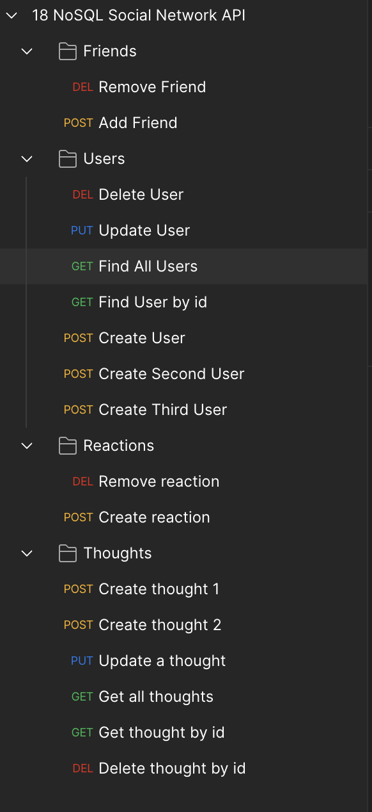

# LinkLoop
      
## Description

This is a social media API that allows users to create an account, create thoughts, add friends, and react to thoughts with other thoughts.

## Table of Contents

- [Installation](#installation)
- [Usage](#usage)
- [Credits](#credits)
- [License](#license)

## Installation

- [Project repo](https://github.com/shaynefw/LinkLoop)
- [Project deployed link](https://shaynefw.github.io/LinkLoop/)
- [Project Video Demo](https://drive.google.com/file/d/1R-E1ibu4GMM7to8QzFXPr7wHMW6QeJfj/view?usp=sharing)

## Usage

1. Start the server by running npm start in the terminal.

2. In Insomnia, create a new request.

3. Enter the appropriate URL for the request you want to make, such as http://localhost:3001/api/users to get all users.

4. Select the appropriate HTTP method, such as GET, POST, PUT, or DELETE.

5. If necessary, enter any required data in the request body.

6. Click the "Send" button to make the request.

7. View the response in the "Response" pane, and make any necessary adjustments to your request or server code.

## Credits

Credits to my professor, instructors, classmates, and tutors for their invaluable support and guidance throughout my learning journey. Also to the developers of the various technologies used, including Google, documentation resources, and AI technologies that have provided valuable assistance and inspiration.

## License

MIT License

Copyright (c) 2023 Shayne Whayne

Permission is hereby granted, free of charge, to any person obtaining a copy
of this software and associated documentation files (the "Software"), to deal
in the Software without restriction, including without limitation the rights
to use, copy, modify, merge, publish, distribute, sublicense, and/or sell
copies of the Software, and to permit persons to whom the Software is
furnished to do so, subject to the following conditions:

The above copyright notice and this permission notice shall be included in all
copies or substantial portions of the Software.

THE SOFTWARE IS PROVIDED "AS IS", WITHOUT WARRANTY OF ANY KIND, EXPRESS OR
IMPLIED, INCLUDING BUT NOT LIMITED TO THE WARRANTIES OF MERCHANTABILITY,
FITNESS FOR A PARTICULAR PURPOSE AND NONINFRINGEMENT. IN NO EVENT SHALL THE
AUTHORS OR COPYRIGHT HOLDERS BE LIABLE FOR ANY CLAIM, DAMAGES OR OTHER
LIABILITY, WHETHER IN AN ACTION OF CONTRACT, TORT OR OTHERWISE, ARISING FROM,
OUT OF OR IN CONNECTION WITH THE SOFTWARE OR THE USE OR OTHER DEALINGS IN THE
SOFTWARE.

## Badges

## Features

The app is built using Node.js, Express.js, and MongoDB/Mongoose. It has two models, User and Thought, with a third sub-document schema called Reaction.

Users can create an account, and have fields for username, email, a list of thoughts they have created, and a list of friends they have added.

Thoughts are created with a text field, and have a timestamp and username attached to them. Thoughts can also be reacted to with other thoughts, which are stored in a sub-document array field called reactions.

Users can add and remove friends from their friends list, and thoughts can be created, updated, and deleted.

## How to Contribute

## Tests

## Questions
  
If you have any questions you can reach me by...
  